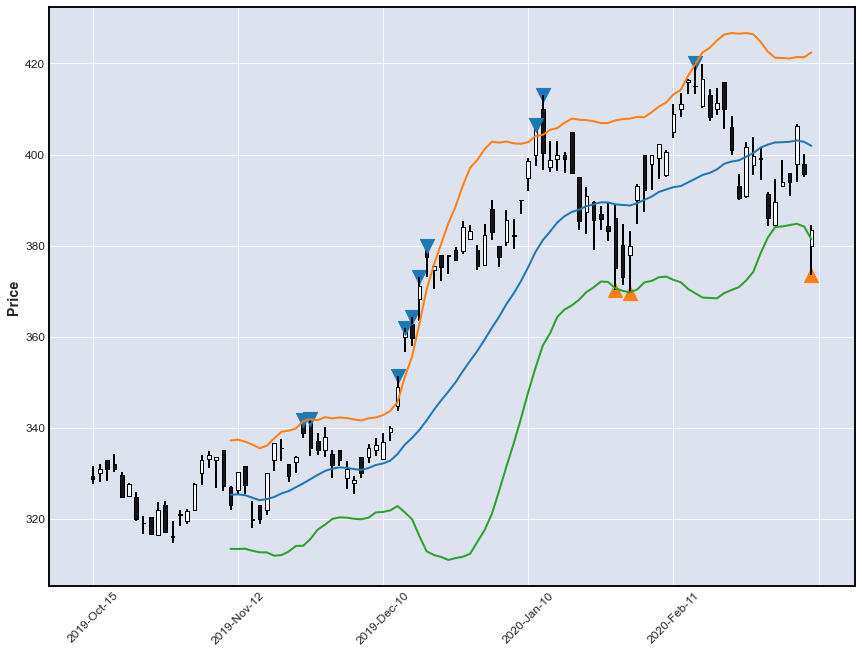

[](https://travis-ci.org/kaelzhang/stock-pandas)
[](https://codecov.io/gh/kaelzhang/stock-pandas)
[](https://pypi.org/project/stock-pandas/)
[](https://github.com/kaelzhang/stock-pandas)

# [stock-pandas](https://github.com/kaelzhang/stock-pandas)

**stock-pandas** inherits and extends `pandas.DataFrame` to support:
- Stock Statistics
- Stock Indicators, including:
  - Trend-following momentum indicators, such as **MA**, **EMA**, **MACD**, **BBI**
  - Dynamic support and resistance indicators, such as **BOLL**
  - Over-bought / over-sold indicators, such as **KDJ**, **RSI**

`stock-pandas` makes automatical trading much easier. `stock-pandas` requires Python >= **3.6**

With the help of `stock-pandas` and mplfinance, we could easily draw something like:



The code example is available at [here](https://github.com/kaelzhang/stock-pandas-examples/blob/master/example/bollinger_bands.ipynb).

## Install

```sh
pip install stock-pandas
```

## Usage

```py
from stock_pandas import StockDataFrame

# or
import stock_pandas as spd
```

We also have some examples with annotations in the [`example`](https://github.com/kaelzhang/stock-pandas/tree/master/example) directory, you could use [JupyterLab](https://jupyter.org/) or Jupyter notebook to play with them.

### StockDataFrame

`StockDataFrame` inherits from `pandas.DataFrame`, so if you are familiar with `pandas.DataFrame`, you are already ready to use `stock-pandas`

```py
import pandas as pd
stock = StockDataFrame(pd.read_csv('stock.csv'))
```

As we know, we could use `[]`, which called **pandas indexing** (a.k.a. `__getitem__` in python) to select out lower-dimensional slices. In addition to indexing with `colname` (column name of the `DataFrame`), we could also do indexing by `directive`s.

```py
stock[directive] # Gets a pandas.Series

stock[[directive0, directive1]] # Gets a StockDataFrame
```

We have an example to show the most basic indexing using `[directive]`

```py
stock = StockDataFrame({
    'open' : ...,
    'high' : ...,
    'low'  : ...,
    'close': [5, 6, 7, 8, 9]
})

stock['ma:2']

# 0    NaN
# 1    5.5
# 2    6.5
# 3    7.5
# 4    8.5
# Name: ma:2,close, dtype: float64
```

Which prints the 2-period simple moving average on column `"close"`.

### stock.exec(directive: str, create_column: bool=False) -> np.ndarray

Executes the given directive and returns a numpy ndarray according to the directive.

```py
stock['ma:5'] # returns a Series

stock.exec('ma:5', create_column=True) # returns a numpy ndarray
```

```py
# This will only calculate without creating a new column in the dataframe
stock.exec('ma:20')
```

### stock.alias(alias: str, name: str) -> None

Defines column alias or directive alias

- **alias** `str` the alias name
- **name** `str` the name of an existing column or the directive string

```py
# Some plot library such as `mplfinance` requires a column named capitalized `Open`,
# but it is ok, we could create an alias.
stock.alias('Open', 'open')

stock.alias('buy_point', 'kdj.j < 0')
```

### stock.append(other, *args, **kwargs) -> StockDataFrame

Appends rows of `other` to the end of caller, returning a new object.

This method has nearly the same hehavior of [`pandas.DataFrame.append()`](https://pandas.pydata.org/pandas-docs/stable/reference/api/pandas.DataFrame.append.html), but instead it returns an instance of `StockDataFrame`

## Syntax of `directive`

```ebnf
directive := command | command operator expression
operator := '/' | '\' | '><' | '<' | '<=' | '==' | '>=' | '>'
expression := float | command

command := command_name | command_name : arguments
command_name := main_command_name | main_command_name.sub_command_name
main_command_name := alphabets
sub_command_name := alphabets

arguments := argument | argument , arguments
argument := empty_string | string | ( directive )
```

#### `directive` Example

Here lists several use cases of column names

```py
# The middle band of bollinger bands
#   which is actually a 20-period (default) moving average
stock['boll']

# kdj j less than 0
# This returns a series of bool type
stock['kdj.j < 0']

# 9-period kdj k cross up 3-day kdj d
stock['kdj.k:9 / kdj.d:3']

# 5-period simple moving average
stock['ma:5']

# 10-period simple moving average on open prices
stock['ma:10,open']

# Dataframe of 5-period, 10-period, 30-period ma
stock[[
    'ma:5',
    'ma:10',
    'ma:30'
]]

# Which means we use the default values of the first and the second parameters,
# and specify the third parameter
stock['macd:,,10']

# We must wrap a parameter which is a nested command or directive
stock['increase:(ma:20,close),3']

# stock-pandas has a powerful directive parser,
# so we could even write directives like this:
stock['''
repeat
    :
        (
            column:close > boll.upper
        ),
        5
''']
```

## Built-in Commands of Indicators

Document syntax explanation:

- **param0** `str` which means `param0` is a required parameter of type `str`.
- **param1?** `str='close'` which means parameter `param1` is optional with default value `'close'`.

Actually, all parameters of a command are of string type, so the `str` here means an interger-like string.

### `ma`, simple Moving Averages

```
ma:<period>,<column>
```

Gets the `period`-period simple moving average on column named `column`.

`SMA` is often confused between simple moving average and smoothed moving average.

So `stock-pandas` will use `ma` for simple moving average and `smma` for smoothed moving average.

- **period** `int` (required)
- **column?** `enum<'open'|'high'|'low'|'close'>='close'` Which column should the calculation based on. Defaults to `'close'`

```py
# which is equivalent to `stock['ma:5,close']`
stock['ma:5']

stock['ma:10,open']
```

### `ema`, Exponential Moving Average

```
ema:<period>,<column>
```

Gets the Exponential Moving Average, also known as the Exponential Weighted Moving Average.

The arguments of this command is the same as `ma`.

### `macd`, Moving Average Convergence Divergence

```
macd:<fast_period>,<slow_period>
macd.signal:<fast_period>,<slow_period>,<signal_period>
macd.histogram:<fast_period>,<slow_period>,<signal_period>
```

- **fast_period?** `int=12` fast period (short period). Defaults to `12`.
- **slow_period?** `int=26` slow period (long period). Defaults to `26`
- **signal_period?** `int=9` signal period. Defaults to `9`

```py
# macd
stock['macd']
stock['macd.dif']

# macd signal band, which is a shortcut for stock['macd.signal']
stock['macd.s']
stock['macd.signal']
stock['macd.dea']

# macd histogram band, which is equivalent to stock['macd.h']
stock['macd.histogram']
stock['macd.h']
stock['macd.macd']
```

### `boll`, BOLLinger bands

```
boll:<period>,<column>
boll.upper:<period>,<times>,<column>
boll.lower:<period>,<times>,<column>
```

- **period?** `int=20`
- **times?** `int=2`
- **column?** `str='close'`

```py
# boll
stock['boll']

# bollinger upper band, a shortcut for stock['boll.upper']
stock['boll.u']
stock['boll.upper]

# bollinger lower band, which is equivalent to stock['boll.l']
stock['boll.lower']
stock['boll.l']
```

### `rsv`, Raw Stochastic Value

```
rsv:<period>
```

Calculates the raw stochastic value which is often used to calculate KDJ

### `kdj`, stochastic oscillator

```
kdj.k:<param_k>
kdj.d:<param_d>
kdj.j:<param_j>
```

- **param_k?** `int=9`
- **param_d?** `int=9`
- **param_j?** `int=9`

```py
# The k series of KDJ 999
stock['kdj.k']

# The KDJ serieses of with parameters 9, 3, and 3
stock[['kdj.k', 'kdj.d:3', 'kdj.j:3']]
```

### `rsi`, Relative Strength Index

```
rsi:<period>
```

Calculates the N-period RSI (Relative Strength Index)

- **period** `int` The period to calculate RSI. `period` should be an int which is larger than `1`

### `bbi`, Bull and Bear Index

```
bbi:<a>,<b>,<c>,<d>
```

Calculates indicator BBI (Bull and Bear Index) which is the average of `ma:3`, `ma:6`, `ma:12`, `ma:24` by default

- **a?** `int=3`
- **b?** `int=6`
- **c?** `int=12`
- **d?** `int=24`

## Built-in Commands for Statistics

### `column`

```
column:<name>
```

Just gets the series of a column. This command is designed to be used together with an operator to compare with another command or as a parameter of some statistics command.

- **name** `str` the name of the column

### `increase`

```
increase:<on_what>,<repeat>,<step>
```

Gets a `bool`-type series each item of which is `True` if the value of indicator `on_what` increases in the last `period`-period.

- **on_what** `str` the command name of an indicator.
- **repeat?** `int=1`
- **direction?** `1 | -1` the direction of "increase". `-1` means decreasing

For example:

```py
# Which means whether the `ma:20,close` line
# (a.k.a. 20-period simple moving average on column `'close'`)
# has been increasing repeatedly for 3 times (maybe 3 days)
stock['increase:(ma:20,close),3']

# If the close price has been decreasing repeatedly for 5 times (maybe 5 days)
stock['increase:close,5,-1']
```

### `style`

```
style:<style>
```

Gets a `bool`-type series whether the candlestick of a period is of `style` style

- **style** `'bullish' | 'bearish'`

```py
stock['style:bullish']
```

### `repeat`

```
repeat:(<bool_directive>),<repeat>
```

The `repeat` command first gets the result of directive `bool_directive`, and detect whether `True` is repeated for `repeat` times

- **bool_directive** `str` the directive which should returns a series of `bool`s. PAY ATTENTION, that the directive should be wrapped with parantheses as a parameter.
- **repeat?** `int=1` which should be larger than `0`

```py
# Whether the bullish candlestick repeats for 3 periods (maybe 3 days)
stock['repeat:(style:bullish),3']
```

## Operators

```
left operator right
```

- **`/`**: whether `left` crosses through `right` from the down side of `right` to the upper side which we call it as "cross up".
- **`\`**: whether `left` crosses down `right`.
- **`><`**: whether `left` crosses `right`, either up or down.
- **`<`** / **`<=`** / **`==`** / **`>=`** / **`>`**: For a certain record of the same time, whether the value of `left` is less than / less than or equal to / equal to / larger than or equal to / larger than the value of `right`.

## Errors

```py
from stock_pandas import (
    DirectiveSyntaxError,
    DirectiveValueError
)
```

### `DirectiveSyntaxError`

Raises if there is a syntax error in the given directive.

```py
stock['''
repeat
    :
        (
            column:close >> boll.upper
        ),
        5
''']
```

`DirectiveSyntaxError` might print some messages like this:

```
File "<string>", line 5, column 26

   repeat
       :
           (
>              column:close >> boll.upper
           ),
           5

                            ^
DirectiveSyntaxError: ">>" is an invalid operator
```

### `DirectiveValueError`

Raises if
- there is an unknown command name
- something is wrong about the command arguments
- etc.

****

## Advanced Sections
